<div align="center">
  <h1 align="center">Ovy MQ</h1>
  <p align="center">
    <em>A high-performance, modular message queue system built with Java and Spring.</em>
    <br />
    <a href="#-english-documentation"><strong>Explore the docs »</strong></a>
    <br />
    <br />
    <a href="https://github.com/jotabrc/ovy_mq/issues">Report Bug</a>
    ·
    <a href="https://github.com/jotabrc/ovy_mq/issues">Request Feature</a>
  </p>
</div>

<details>
<summary><strong>Table of Contents</strong></summary>
<ol>
  <li><a href="#-english-documentation">English Documentation</a>
    <ul>
      <li><a href="#about-the-project">About The Project</a></li>
      <li><a href="#system-flows">System Flows</a></li>
      <li><a href="#getting-started">Getting Started</a></li>
      <li><a href="#usage">Usage</a></li>
      <li><a href="#advanced-usage-handling-processing-outcomes">Advanced Usage: Handling Processing Outcomes</a></li>
      <li><a href="#detailed-configuration">Detailed Configuration</a></li>
      <li><a href="#contributing">Contributing</a></li>
      <li><a href="#license">License</a></li>
    </ul>
  </li>
  <li><a href="#-documentação-em-português">Portuguese Documentation</a>
    <ul>
      <li><a href="#sobre-o-projeto">Sobre o Projeto</a></li>
      <li><a href="#fluxos-do-sistema">Fluxos do Sistema</a></li>
      <li><a href="#começando">Começando</a></li>
      <li><a href="#uso">Uso</a></li>
      <li><a href="#uso-avançado-tratando-resultados-de-processamento">Uso Avançado: Tratando Resultados de Processamento</a></li>
      <li><a href="#configuração-detalhada">Configuração Detalhada</a></li>
      <li><a href="#como-contribuir">Como Contribuir</a></li>
      <li><a href="#licença">Licença</a></li>
    </ul>
  </li>
</ol>
</details>

---

> [!CAUTION]
> **This project is under active development.**
> Features may be incomplete or change. Not recommended for production use at this stage.

---

## 🇺🇸 English Documentation

### About The Project

Ovy MQ is a high-performance Message Queue system built in Java using the Spring framework. The project is designed to be modular, facilitating maintenance and scalability, with communication based on the STOMP protocol over WebSockets.

The platform allows client applications to consume messages declaratively using the `@OvyListener` annotation, abstracting away the complexity of connection and session management. The server handles the consumer lifecycle, message routing, and provides features like auto-scaling of listeners and health checks.

#### Key Features

*   **WebSocket/STOMP Communication**: Full-duplex and efficient communication.
*   **Declarative Consumers**: Create message consumers with the simple `@OvyListener` annotation.
*   **Resilient Connection**: Automatic connection retries with configurable timeout, making the client resilient to network failures.
*   **Asynchronous Retry with Backoff**: In case of processing failure, the system automatically retries the operation asynchronously with a progressive backoff delay, preventing thread blocking and increasing resilience.
*   **Extensible Hooks**: Provides the `ListenerAfterProcessingHandler` interface to handle processing success or failure, enabling custom logic like Dead-Letter Queues (DLQ).
*   **Modular Architecture**:
    *   `ovy_mq_core`: Shared entities, DTOs, and interfaces.
    *   `ovy_mq_client`: Client library for integration with your applications.
    *   `ovy_mq`: The message queue server.
*   **Consumer Auto-Scaling**: The server can dynamically instruct clients to increase or decrease the number of consumers for a topic.
*   **Health Checks**: Built-in mechanism to monitor the health of client connections.
*   **Graceful Shutdown**: Ensures that in-flight messages are not lost when the application shuts down.
*   **Reaper Task**: Re-queues messages that were sent to a client but never received a confirmation (ACK), ensuring message delivery even in case of client failures.

### System Flows

#### Standard Message Flow

This diagram shows the complete lifecycle of a message, from producer to consumer, including the post-processing hooks. The entire processing cycle, including retries, is handled asynchronously.


#### Listener Registration and Scaling

This flow illustrates how a new consumer registers itself and how the server can scale it.


#### Background Flows

These are periodic tasks that ensure system health and message flow.


### Getting Started

#### Prerequisites

*   Java 17+
*   Maven

#### Server Configuration

The `ovy_mq` server is configured via the `src/main/resources/application.yml` file.

**Credentials:** Credentials are managed in the `src/main/resources/credential.yml` file.
```yaml
# credential.yml
application:
  credential:
    bcrypt: $2a$10$FewIB0NHzGc/RexhYkk1eepP0xsUC77UQilUFFz.LbNZFoUQ2N99a
```

### Usage

To create a consumer, add the `ovy_mq_client` dependency to your application and annotate a method with `@OvyListener`.

**Consumer Example:**
```java
import io.github.jotabrc.ovy_mq_core.domain.client.OvyListener;
import org.springframework.stereotype.Component;

@Component
public class MyListener {

    @OvyListener(
        topic = "my-awesome-topic",
        quantity = 2, // Starts 2 consumers for this topic
        max = 10,     // Allows scaling up to 10 consumers
        min = 1       // Keeps at least 1 consumer active
    )
    public void processMessage(String payload) {
        System.out.println("Message received: " + payload);
        // Your business logic here
    }
}
```

### Advanced Usage: Handling Processing Outcomes

You can implement the `ListenerAfterProcessingHandler` interface to execute custom logic after a message is processed, either successfully or after all retry attempts have failed. This is the ideal place to implement a Dead-Letter Queue (DLQ).

**Example of a DLQ Handler:**
```java
import io.github.jotabrc.ovy_mq_client.component.listener.ListenerAfterProcessingHandler;
import lombok.extern.slf4j.Slf4j;
import org.springframework.stereotype.Component;

@Slf4j
@Component
public class MyAfterProcessingHandler implements ListenerAfterProcessingHandler {

    @Override
    public <T> void afterSuccess(T payload) {
        log.info("Successfully processed payload: {}", payload);
    }

    @Override
    public <T> void afterFailure(T payload, RuntimeException throwable) {
        log.error("Failed to process payload after all retries. Sending to DLQ. Payload: {}", payload, throwable);
        // Logic to send the payload to a Dead-Letter Queue (e.g., another topic, a database, etc.)
    }
}
```

### Detailed Configuration

The application offers a high degree of customization through parameters in the `@OvyListener` annotation and properties in `application.yml`.

#### The `@OvyListener` Annotation

| Parameter | Type | Default | Description | Status |
| :--- | :--- | :--- | :--- | :--- |
| `topic` | `String` | - | Name of the topic to consume messages from. | **Functional** |
| `quantity` | `int` | `1` | Number of consumer instances to start with the application. | **Functional** |
| `max` | `int` | `3` | Maximum number of consumers for scaling. | **Functional** |
| `min` | `int` | `1` | Minimum number of active consumers. | **Functional** |
| `step` | `int` | `1` | Number of consumers to add/remove at a time during auto-scaling. | **Functional** |
| `autoManage` | `boolean`| `false` | > [!NOTE] If `true`, allows the server to manage replicas automatically. | **Not Implemented** |
| `processingTimeout` | `long` | `150000` | Timeout (ms) for processing a single message. | **Functional** |
| `pollInitialDelay` | `long` | `10000` | Initial delay (ms) before the first message `poll`. | **Functional** |
| `pollFixedDelay` | `long` | `35000` | Interval (ms) for message `poll`. | **Functional** |
| `healthCheckInitialDelay` | `long` | `10000` | Initial delay (ms) for the first health check. | **Functional** |
| `healthCheckFixedDelay` | `long` | `35000` | Interval (ms) between health checks. | **Functional** |
| `healthCheckExpirationTime` | `long` | `120000` | Expiration time (ms) for a health check response. | **Functional** |
| `connectionMaxRetries` | `int` | `50` | Maximum number of reconnection attempts. | **Functional** |
| `connectionTimeout` | `long` | `150000` | Timeout (ms) for establishing a connection. | **Functional** |
| `useGlobalValues` | `boolean`| `false` | If `true`, forces the use of global values from `application.yml`. | **Functional** |

#### Global Properties (`@Value`)

##### Server (`ovy_mq`)

| Property | Default | Description |
| :--- | :--- | :--- |
| `server.port` | `9090` | Port where the server will run. |
| `ovymq.task.reaper.active` | `true` | Activates the task that monitors unconfirmed messages and re-queues them if no ACK is received within a timeout. |
| `ovymq.task.reaper.delay` | `60000` | Interval (ms) for the `reaper` task execution. |
| `ovymq.task.shutdown.wait-delay` | `10000` | Wait interval (ms) during graceful shutdown. |
| `ovymq.task.shutdown.max-wait` | `180000` | Maximum wait time (ms) during graceful shutdown. |

##### Client (`ovy_mq_client`)

| Property | Default | Description |
| :--- | :--- | :--- |
| `ovymq.client.processing.max-retries` | `3` | Maximum number of reprocessing attempts in case of failure. |
| `ovymq.client.processing.exponential-timer` | `1000` | Base delay (ms) for the progressive backoff between retries. |
| `ovymq.client.processing.timeout` | `150000` | **Global default:** Message processing timeout (ms). |
| `ovymq.task.shutdown.wait-delay` | `1000` | Client's wait interval (ms) during graceful shutdown. |
| `ovymq.task.shutdown.max-wait` | `180000` | Client's maximum wait time (ms) during graceful shutdown. |
| `ovymq.session-manager.connection.timeout` | `150000` | **Global default:** Connection timeout (ms). |
| `ovymq.session-manager.connection.max-retries`| `10` | **Global default:** Maximum reconnection attempts. |
| `ovymq.task.health-check.initial.delay` | `10000` | **Global default:** Initial delay (ms) for health check. |
| `ovymq.task.health-check.fixed-delay` | `60000` | **Global default:** Health check interval (ms). |
| `ovymq.task.health-check.expiration-time` | `120000` | **Global default:** Health check expiration time (ms). |
| `ovymq.task.listener-poll.initial-delay` | `10000` | **Global default:** Initial delay (ms) for `poll`. |
| `ovymq.task.listener-poll.fixed-delay` | `35000` | **Global default:** `poll` interval (ms). |
| `ovy.executor.client-task.core-pool-size` | `1` | Threads for client's scheduled tasks. |
| `ovy.executor.listener.core-pool-size` | `3` | Threads for listener execution (`@OvyListener`). |
| `ovy.executor.listener-task.max-pool-size` | `10` | Maximum threads for listeners. |
| `ovy.executor.listener-task.queue-capacity`| `25` | Queue size for listener tasks. |
| `ovy.executor.producer.core-pool-size` | `1` | Threads for message sending. |
| `ovy.executor.producer-task.max-pool-size` | `1` | Maximum threads for message sending. |
| `ovy.executor.producer-task.queue-capacity` | `25` | Queue size for message sending tasks. |

### Contributing

Contributions are welcome! If you find a bug or have a suggestion for improvement, please open an issue in this repository.

### License

This project is distributed under the MIT License. See the `LICENSE` file for more details.

---
<br>

## 🇧🇷 Documentação em Português

### Sobre o Projeto

Ovy MQ é um sistema de mensageria (Message Queue) de alta performance, construído em Java com o framework Spring. O projeto é desenhado de forma modular para facilitar a manutenção e escalabilidade, e a comunicação é baseada no protocolo STOMP sobre WebSockets.

A plataforma permite que aplicações cliente consumam mensagens de forma declarativa com a anotação `@OvyListener`, abstraindo a complexidade da gestão de conexões e sessões. O servidor gerencia o ciclo de vida dos consumidores, o roteamento de mensagens e oferece funcionalidades como auto-scaling de listeners e health checks.

#### Principais Funcionalidades

*   **Comunicação via WebSocket/STOMP**: Comunicação full-duplex e eficiente.
*   **Consumidores Declarativos**: Crie consumidores de mensagens com a simples anotação `@OvyListener`.
*   **Conexão Resiliente**: Retentativas de conexão automáticas com timeout configurável, tornando o cliente resiliente a falhas de rede.
*   **Retry Assíncrono com Backoff**: Em caso de falha no processamento, o sistema automaticamente tenta reexecutar a operação de forma assíncrona com um atraso progressivo (backoff), evitando o bloqueio de threads e aumentando a resiliência.
*   **Hooks Extensíveis**: Fornece a interface `ListenerAfterProcessingHandler` para tratar o sucesso ou a falha do processamento, permitindo lógicas customizadas como Dead-Letter Queues (DLQ).
*   **Arquitetura Modular**:
    *   `ovy_mq_core`: Entidades, DTOs e interfaces compartilhadas.
    *   `ovy_mq_client`: Biblioteca cliente para integração com suas aplicações.
    *   `ovy_mq`: O servidor de mensageria.
*   **Auto-Scaling de Consumidores**: O servidor pode instruir os clientes a aumentar ou diminuir o número de consumidores para um tópico dinamicamente.
*   **Health Checks**: Mecanismo integrado para monitorar a saúde das conexões dos clientes.
*   **Graceful Shutdown**: Garante que mensagens em processamento não sejam perdidas durante o desligamento da aplicação.
*   **Tarefa Reaper**: Re-enfileira mensagens que foram enviadas a um cliente, mas cuja confirmação (ACK) nunca foi recebida, garantindo a entrega da mensagem mesmo em caso de falhas do cliente.

### Fluxos do Sistema

#### Fluxo Padrão de Mensagem

Este diagrama mostra o ciclo de vida completo de uma mensagem, do produtor ao consumidor, incluindo os hooks de pós-processamento. Todo o ciclo de processamento, incluindo as retentativas, é gerenciado de forma assíncrona.

```mermaid
sequenceDiagram
    participant Produtor
    participant Servidor OvyMQ
    participant Consumidor
    participant ListenerAfterProcessingHandler

    Produtor->>Servidor OvyMQ: 1. Envia Mensagem (Payload)
    Servidor OvyMQ-->>Produtor: 2. Confirma Recebimento
    Servidor OvyMQ->>Consumidor: 3. Entrega Mensagem
    Consumidor->>Consumidor: 4. Executa lógica de negócio (de forma assíncrona com retentativas)
    alt Processamento com Sucesso
        Consumidor->>ListenerAfterProcessingHandler: 5a. afterSuccess(payload)
    else Processamento Falhou
        Consumidor->>ListenerAfterProcessingHandler: 5b. afterFailure(payload, exception)
    end
    Consumidor-->>Servidor OvyMQ: 6. Confirma e requisita próxima mensagem
```



#### Registro e Scaling de Listeners

Este fluxo ilustra como um novo consumidor se registra e como o servidor pode escalá-lo.

```mermaid
sequenceDiagram
    participant Aplicação Consumidora
    participant Servidor OvyMQ

    Aplicação Consumidora->>Servidor OvyMQ: 1. Registra Listener (envia config do @OvyListener)
    Servidor OvyMQ-->>Aplicação Consumidora: 2. Confirma Registro

    loop Processo de Scaling
        Servidor OvyMQ->>Aplicação Consumidora: 3. Envia Comando de Scaling (ex: nova 'quantity')
        Aplicação Consumidora->>Aplicação Consumidora: 4. Ajusta o número de listeners ativos
        Aplicação Consumidora-->>Servidor OvyMQ: 5. Confirma Scaling
    end
```



#### Fluxos em Background

Estas são tarefas periódicas que garantem a saúde do sistema e o fluxo de mensagens.

```mermaid
graph TD
    subgraph Health Check
        A[Servidor OvyMQ] -- 1. Requisita Status de Saúde --> B(Consumidor);
        B -- 2. Responde com 'vivo' --> A;
    end

    subgraph Polling de Mensagens
        C(Consumidor) -- 1. Está ocioso? --> D{Enviar Requisição de Poll};
        D -- 2. Requisita nova mensagem --> E[Servidor OvyMQ];
        E -- 3. Envia mensagem se disponível --> C;
    end

    subgraph Tarefa Reaper
        F[Servidor OvyMQ] -- 1. Monitora mensagens não confirmadas --> G(Mensagens enviadas aos Consumidores);
        G -- 2. Se ACK não recebido dentro do timeout --> H{Re-enfileira mensagem};
    end
```



### Getting Started

#### Pré-requisitos

*   Java 17+
*   Maven

#### Configuração do Servidor

O servidor `ovy_mq` é configurado através do arquivo `src/main/resources/application.yml`.

**Credenciais:** As credenciais são gerenciadas no arquivo `src/main/resources/credential.yml`.
```yaml
# credential.yml
application:
  credential:
    bcrypt: $2a$10$FewIB0NHzGc/RexhYkk1eepP0xsUC77UQilUFFz.LbNZFoUQ2N99a
```

### Uso

Para criar um consumidor, adicione a dependência `ovy_mq_client` à sua aplicação e anote um método com `@OvyListener`.

**Exemplo de Consumidor:**
```java
import io.github.jotabrc.ovy_mq_core.domain.client.OvyListener;
import org.springframework.stereotype.Component;

@Component
public class MeuListener {

    @OvyListener(
        topic = "meu-topico-incrivel",
        quantity = 2, // Inicia 2 consumidores para este tópico
        max = 10,     // Permite escalar até 10 consumidores
        min = 1       // Mantém no mínimo 1 consumidor
    )
    public void processarMensagem(String payload) {
        System.out.println("Mensagem recebida: " + payload);
        // Sua lógica de negócio aqui
    }
}
```

### Uso Avançado: Tratando Resultados de Processamento

Você pode implementar a interface `ListenerAfterProcessingHandler` para executar uma lógica customizada após uma mensagem ser processada, seja com sucesso ou após todas as tentativas de retry falharem. Este é o local ideal para implementar uma Dead-Letter Queue (DLQ).

**Exemplo de um Handler de DLQ:**
```java
import io.github.jotabrc.ovy_mq_client.component.listener.ListenerAfterProcessingHandler;
import lombok.extern.slf4j.Slf4j;
import org.springframework.stereotype.Component;

@Slf4j
@Component
public class MeuAfterProcessingHandler implements ListenerAfterProcessingHandler {

    @Override
    public <T> void afterSuccess(T payload) {
        log.info("Payload processado com sucesso: {}", payload);
    }

    @Override
    public <T> void afterFailure(T payload, RuntimeException throwable) {
        log.error("Falha ao processar payload após todas as tentativas. Enviando para DLQ. Payload: {}", payload, throwable);
        // Lógica para enviar o payload para uma Dead-Letter Queue (ex: outro tópico, um banco de dados, etc.)
    }
}
```

### Configuração Detalhada

A aplicação oferece um alto grau de personalização através de parâmetros na anotação `@OvyListener` e de propriedades no `application.yml`.

#### A Anotação `@OvyListener`

| Parâmetro | Tipo | Padrão | Descrição | Status |
| :--- | :--- | :--- | :--- | :--- |
| `topic` | `String` | - | Nome do tópico para consumir mensagens. | **Funcional** |
| `quantity` | `int` | `1` | Número de consumidores a serem iniciados com a aplicação. | **Funcional** |
| `max` | `int` | `3` | Número máximo de consumidores para scaling. | **Funcional** |
| `min` | `int` | `1` | Número mínimo de consumidores ativos. | **Funcional** |
| `step` | `int` | `1` | Número de consumidores a adicionar/remover por vez no auto-scaling. | **Funcional** |
| `autoManage` | `boolean` | `false` | > [!NOTE] Se `true`, permite que o servidor gerencie réplicas automaticamente. | **Não Implementado** |
| `processingTimeout` | `long` | `150000` | Timeout (ms) para o processamento de uma mensagem. | **Funcional** |
| `pollInitialDelay` | `long` | `10000` | Atraso inicial (ms) antes do primeiro `poll` de mensagens. | **Funcional** |
| `pollFixedDelay` | `long` | `35000` | Intervalo (ms) para o `poll` de mensagens. | **Funcional** |
| `healthCheckInitialDelay` | `long` | `10000` | Atraso inicial (ms) para o primeiro *health check*. | **Funcional** |
| `healthCheckFixedDelay` | `long` | `35000` | Intervalo (ms) entre os *health checks*. | **Funcional** |
| `healthCheckExpirationTime` | `long` | `120000` | Tempo (ms) de expiração para uma resposta de *health check*. | **Funcional** |
| `connectionMaxRetries` | `int` | `50` | Número máximo de tentativas de reconexão. | **Funcional** |
| `connectionTimeout` | `long` | `150000` | Timeout (ms) para estabelecer uma conexão. | **Funcional** |
| `useGlobalValues` | `boolean` | `false` | Se `true`, força o uso dos valores globais do `application.yml`. | **Funcional** |

#### Propriedades Globais (`@Value`)

##### Servidor (`ovy_mq`)

| Propriedade | Padrão | Descrição |
| :--- | :--- | :--- |
| `server.port` | `9090` | Porta onde o servidor irá rodar. |
| `ovymq.task.reaper.active` | `true` | Ativa a tarefa que monitora mensagens não confirmadas e as re-enfileira se nenhum ACK for recebido dentro de um timeout. |
| `ovymq.task.reaper.delay` | `60000` | Intervalo (ms) para a execução da tarefa `reaper`. |
| `ovymq.task.shutdown.wait-delay` | `10000` | Intervalo (ms) de espera durante o *graceful shutdown*. |
| `ovymq.task.shutdown.max-wait` | `180000` | Tempo máximo (ms) de espera no *graceful shutdown*. |

##### Cliente (`ovy_mq_client`)

| Propriedade | Padrão | Descrição |
| :--- | :--- | :--- |
| `ovymq.client.processing.max-retries` | `3` | Número máximo de tentativas de reprocessamento em caso de falha. |
| `ovymq.client.processing.exponential-timer` | `1000` | Atraso base (ms) para o backoff progressivo entre as retentativas. |
| `ovymq.client.processing.timeout` | `150000` | **Padrão global:** Timeout (ms) para processamento de mensagem. |
| `ovymq.task.shutdown.wait-delay` | `1000` | Intervalo (ms) de espera durante o *graceful shutdown* do cliente. |
| `ovymq.task.shutdown.max-wait` | `180000` | Tempo máximo (ms) de espera no *graceful shutdown* do cliente. |
| `ovymq.session-manager.connection.timeout` | `150000` | **Padrão global:** Timeout (ms) para conexão. |
| `ovymq.session-manager.connection.max-retries`| `10` | **Padrão global:** Máximo de tentativas de reconexão. |
| `ovymq.task.health-check.initial.delay` | `10000` | **Padrão global:** Atraso inicial (ms) para *health check*. |
| `ovymq.task.health-check.fixed-delay` | `60000` | **Padrão global:** Intervalo (ms) dos *health checks*. |
| `ovymq.task.health-check.expiration-time` | `120000` | **Padrão global:** Tempo (ms) de expiração do *health check*. |
| `ovymq.task.listener-poll.initial-delay` | `10000` | **Padrão global:** Atraso inicial (ms) para `poll`. |
| `ovymq.task.listener-poll.fixed-delay` | `35000` | **Padrão global:** Intervalo (ms) do `poll`. |
| `ovy.executor.client-task.core-pool-size` | `1` | Threads para tarefas agendadas do cliente. |
| `ovy.executor.listener.core-pool-size` | `3` | Threads para execução dos listeners (`@OvyListener`). |
| `ovy.executor.listener-task.max-pool-size` | `10` | Máximo de threads para os listeners. |
| `ovy.executor.listener-task.queue-capacity`| `25` | Tamanho da fila para tarefas dos listeners. |
| `ovy.executor.producer.core-pool-size` | `1` | Threads para envio de mensagens. |
| `ovy.executor.producer-task.max-pool-size` | `1` | Máximo de threads para envio de mensagens. |
| `ovy.executor.producer-task.queue-capacity` | `25` | Tamanho da fila para envio de mensagens. |

### Como Contribuir

Contribuições são bem-vindas! Se você encontrar um bug ou tiver uma sugestão de melhoria, por favor, abra uma *issue* neste repositório.

### Licença

Este projeto é distribuído sob a licença MIT. Veja o arquivo `LICENSE` para mais detalhes.
